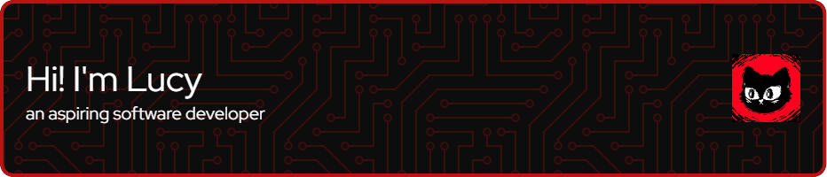
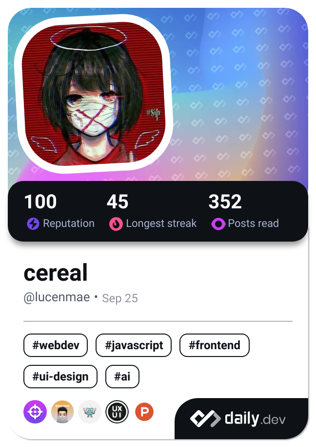

  

  

## 🚀 About Me

<table style="border-collapse: collapse; border: 1px solid #BD1212;">
<tr>
<td width="70%" style="border: none; padding: 20px;">

🔭 Currently building Meeples-Landing, a site for a school organization

🌱 I'm currently learning **Angular**, **Node.js**, and **UX Design**

💡 I love creating user-friendly web applications

🎯 2025 Goals: Finish Meeples-Landing and learn more about UX Design

📫 Let's connect! Email me at: **lucymaetan@gmail.com**

</td>
<td width="30%" style="border: none; padding: 20px;">

</td>
</tr>
</table>

## 🛠️ Tech Stack

  <h3>Frontend</h3>
  
  
  
  
  
  
  
  

  <h3>Backend & Database</h3>
  
  
  
  

  <h3>Tools & Design</h3>
  
  
  
  
  
  
  
  

## 📊 Stats

  

    
    
  

  

## 🏆 Trophies

  

## 🎵 Currently Vibing To

  

## 🤝 Connect With Me

  
  

## 🔥 Recent Activity

<!--START_SECTION:activity-->
<!--END_SECTION:activity-->

## 🚀 Featured Projects

  

