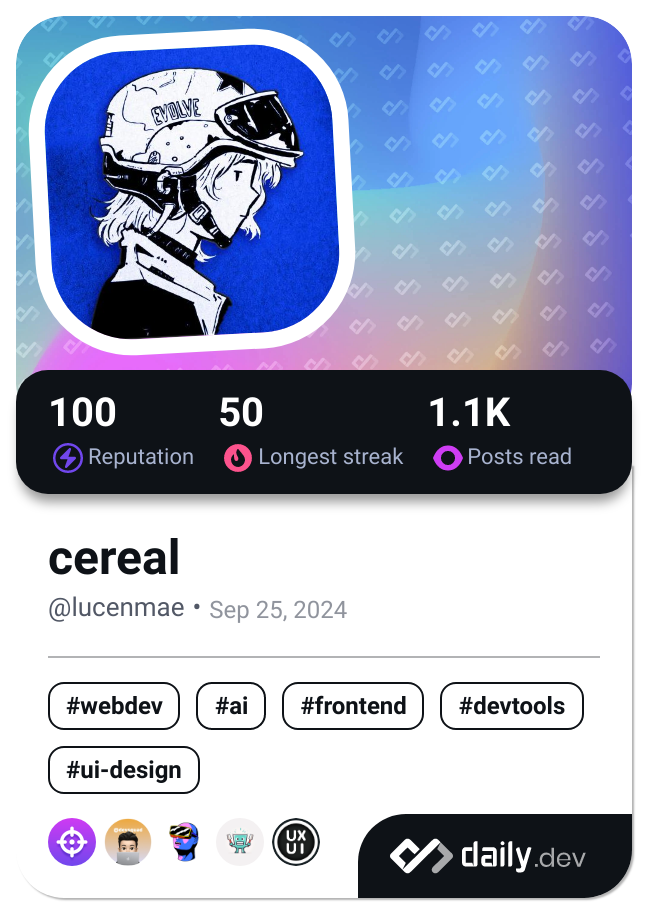

  

  

## 🚀 About Me

  

    - 🔭 Currently building Meeples-Landing, a site for a school organization 
    - 🌱 I'm currently learning **Angular**, **Node.js**, and **UX Design** 
    - 💡 I love creating user-friendly web applications 
    - 🯠2025 Goals: Create more hobby projects 
    - 📫 Let’s connect! Email me at: **lucymaetan@gmail.com**
  

  
  

## 🛠️ Tech Stack

  <h3>Frontend</h3>
  
  
  <h3>Backend & Database</h3>
  
  
  <h3>Tools & Design</h3>
  

## 📊 Stats

  

    
    
  

  

## 🏆Trophies

  

## 🎵 Currently Vibing To

  

## 🤝 Connect With Me

  
  

